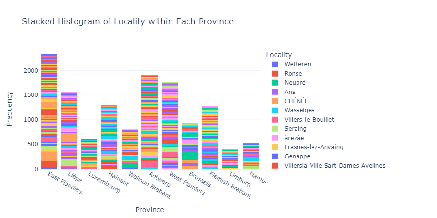
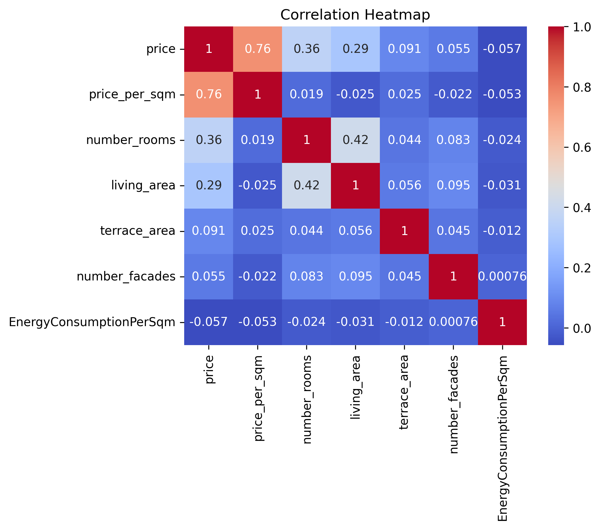
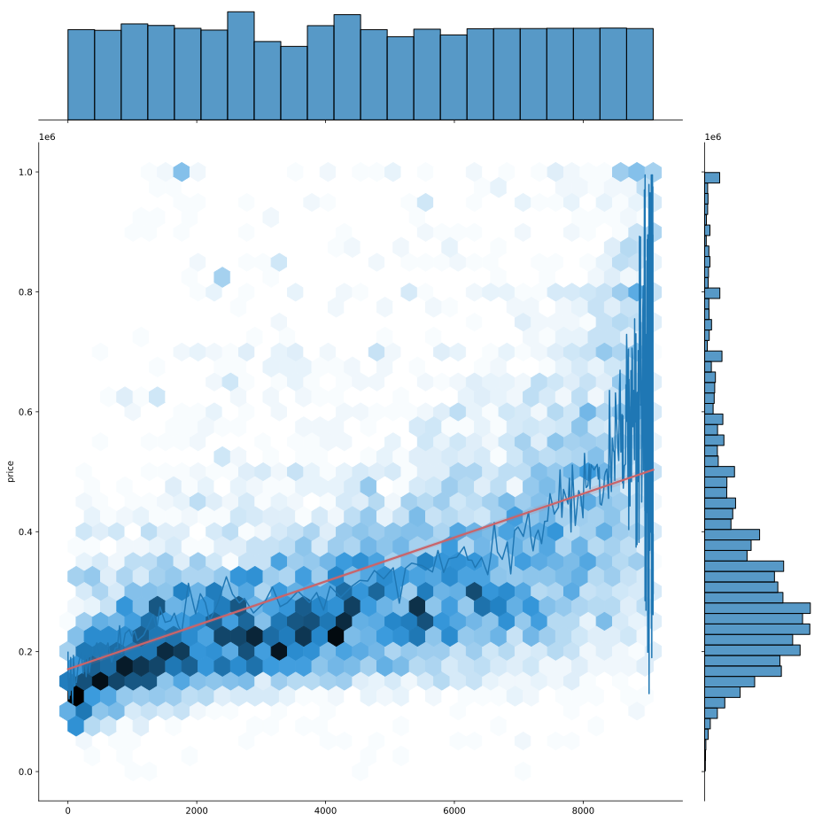

# Immo-Eliza-MAS-FN-Analysis



## Description
The Immo Eliza Data Analysis project focuses on analyzing a dataset of properties including houses and apartments for sale from the website Immoweb. It involves cleaning the dataset, performing exploratory data analysis, and creating visualizations to gain insights into the properties and their characteristics.

## Installation
To run the project, you need to install the required libraries. You can click on the badge links to learn more about each library and its specific version used in this project. You can install them manually using pip install <library name> or just running pip install -r requirements.txt.

. Install the required libraries:

   - [](https://python.org)
   - [](https://pandas.pydata.org/)
   - [](https://numpy.org/)
   - [](https://matplotlib.org/)
   - [](https://seaborn.pydata.org/)
   - [](https://scikit-learn.org/stable/)

## The dataset
It includes about 39000 properties scrapped from ImmoWeb: [Immoweb](https://www.immoweb.be) 

## Usage
```python
# def analyze_column(df_clean, column_name):
    column = df_clean[column_name]
    num_nan = column.isnull().sum()
    num_unique = column.nunique()
    unique_values = column.unique()
    percentage_nan = (num_nan / len(column)) * 100
    percentage_unique = (num_unique / len(column)) * 100
    print(f"Analysis for column '{column_name}':")
    print(f"Number of NaN values: {num_nan}")
    print(f"Number of unique values: {num_unique}")
    print(f"Percentage of NaN values: {percentage_nan:.2f}%")
    print(f"Percentage of unique values: {percentage_unique:.2f}%")
    print(f"Unique values: {unique_values}")
'''

## Data Cleaning 
The cleaning phase is very important: without a good cleaning, our analysis could be badly influenced by outliers. 

-	Removing duplicates and empty rows
-	Removing the rows without price as a dependent variable
-	Exploring columns with some functions, and replacing or imputing missing values if needed. 
-	Removing the outliers (error, incorrect or absurd)
-	Removing some useless columns due to their high rate of *None* value. 

## Data analysis 
This is where the fun starts! 🥳

Five people know more than one.

To get the most out of our data, and to allow each of us to get experience manipulating Pandas and Seaborn, we decided to work separately. One group worked on the house data and one group on the apartment data. Later we reviewed our work and merged the results.

Our target: The Price.
The price is the target of this challenge, as our goal is to create a machine-learning model to predict prices on Belgium's sales.

Correlation between variables?
To identify the correlation, we used this heatmap:





#### Observations
- The Price is mainly correlated with the Number of rooms, living area, energy consumption and the building state. 
- The Number of rooms and living areas seems mainly correlated with each other.

## Contributors

Team members are Afaf, Miguel Bueno, Nasrin, Shweta Jain, and Fabienne.

## Timeline
This analysis took form in five days.
